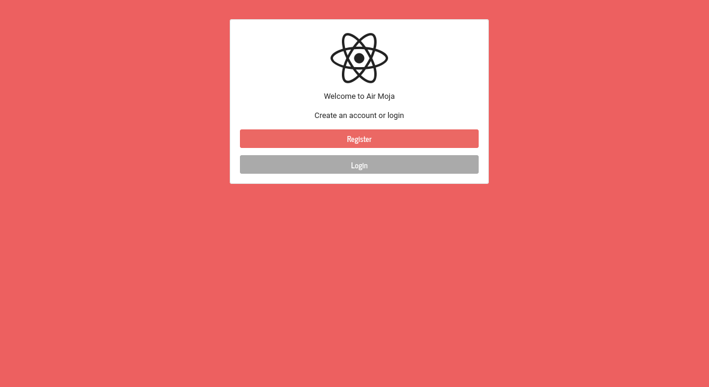

# Node.js
backend

To Run project:
~/Node.js/passport_authentication$ node app.js

This has to be one of the most challenging projects I have had to create and design but always having a positive mindset to finish it pushed me through.

I have created a passport authentication back end based project that lets you register,sign in and log out .

This project includes:
Express.js
Node.js
passport.js
ejs.js
bcrypt.js
npm
mongodb
boostrap framework
and Rest api.

It was a tough journey but finally done.
Enjoy and it was created by yours truly
